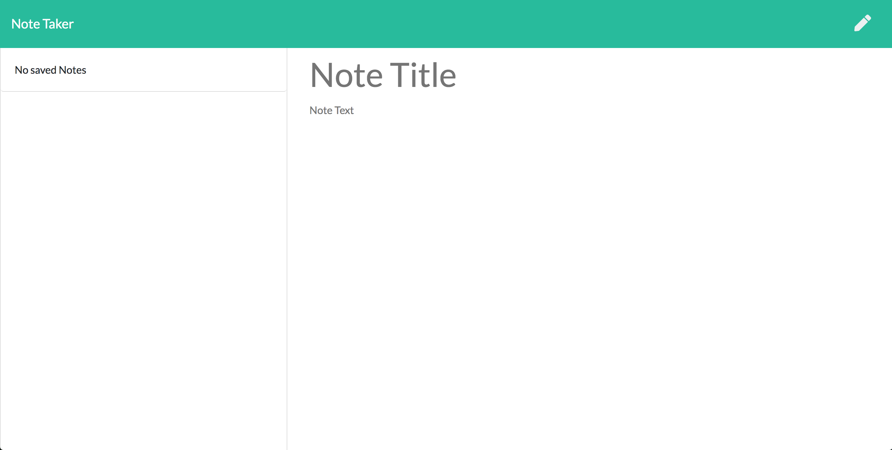
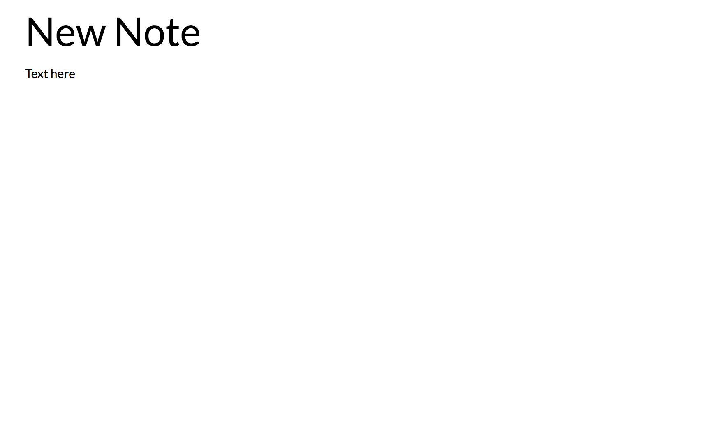
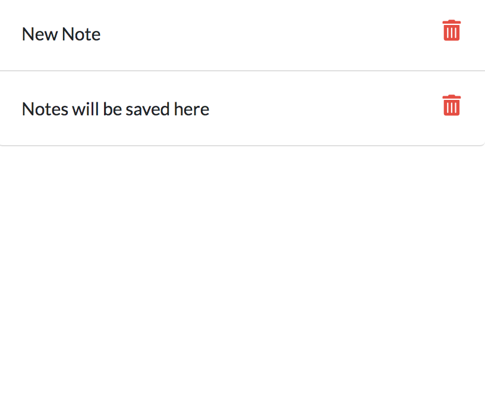

# notes-app
  
  

  ## Description
  This app allows users to create and save notes. The notes will be saved to a server and displayed on the page.
  
  ## Table of Contents
  1. [Installation](#Installation)
  2. [Usage](#Usage)
  3. [License](#License)
  4. [Contact Information](#Questions)
  
  ## Installation
  * Download the repository 
  * run npm i 

  ## Usage
  * Type your notes in the text area 
  * Press the save button to save to the server 
  * Use the delete button to delete the note

  ## License
  This project is licensed under the MIT license.

  ## Questions
  **Github:** [jesusefraingonzalez](https://github.com/jesusefraingonzalez)
  
  Contact me at jesusgonzalez0797@gmail.com with any additional questions. 
  
  
  
  